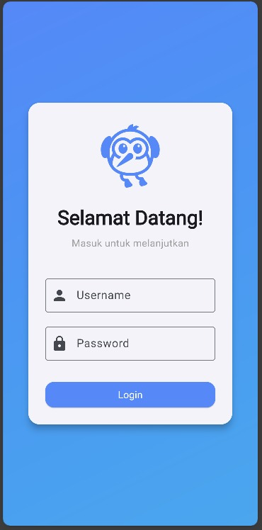
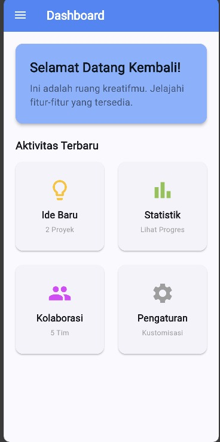
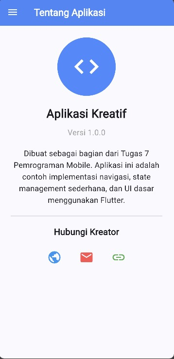

Tugas 7 - Prak. Pemrograman Mobile 

Khaila Salsa Marfah Bilqis
H1D023030
Shift H / Shift C 

Tampilkan Aplikasi 

Struktur Aplikasi Utama (main.dart)
File ini adalah titik masuk aplikasi.

Inisialisasi & Status Login: Menggunakan WidgetsFlutterBinding.ensureInitialized() dan SharedPreferences untuk memeriksa status isLoggedIn saat aplikasi dimulai.

MyApp Widget: Mendefinisikan tema aplikasi (menggunakan Colors.blueAccent) dan menentukan initialRoute.

Jika isLoggedIn adalah true, rute awal adalah /home.

Jika isLoggedIn adalah false, rute awal adalah /login.

Routing: Mendefinisikan rute untuk /login, /home, dan /about.

Halaman Login (login_page.dart)
Halaman untuk masuk ke aplikasi.

UI: Tampilan login terpusat dengan latar belakang gradient dan Card yang berisi icon Flutter, field untuk Username & Password (TextField), dan tombol Login (ElevatedButton).

Simulasi Login: Fungsi _login() mensimulasikan proses masuk dengan Future.delayed(const Duration(seconds: 1)) dan kemudian:

Mengatur status isLoggedIn ke true di SharedPreferences.

Menavigasi ke halaman /home menggunakan Navigator.pushReplacementNamed, yang mencegah pengguna kembali ke halaman Login dengan tombol back.

Halaman Home (home_page.dart)
Halaman utama (Dashboard) yang hanya bisa diakses setelah login.

AppBar & Drawer: Memiliki AppBar dan menggunakan widget SideMenu sebagai laci navigasi (drawer).

Konten: Menggunakan ListView dan GridView untuk menampilkan:

Kartu sambutan.

Empat kartu fitur (_buildFeatureCard) dengan icon dan judul, disusun dalam grid 2 kolom.

Interaksi: Ketika salah satu kartu fitur diketuk, muncul SnackBar pemberitahuan.

Halaman About (about_page.dart)
Menyediakan informasi tentang aplikasi dan kreator.

AppBar & Drawer: Memiliki AppBar dan menggunakan widget SideMenu.

Konten: Menampilkan informasi versi, deskripsi singkat, dan icon untuk menghubungi kreator (GitHub, Email, LinkedIn).

_launchURL: Fungsi yang menggunakan paket url_launcher untuk membuka URL eksternal (tautan media sosial/email) di browser atau aplikasi terkait.

SideMenu (sidemenu.dart)
Widget Drawer yang digunakan untuk navigasi antar halaman Home dan About, serta fungsi Logout.

UserAccountsDrawerHeader: Menampilkan informasi pengguna di bagian atas laci.

ListTile Navigasi:

Home & About: Menutup drawer (Navigator.pop(context)) dan menavigasi ke halaman yang dipilih menggunakan Navigator.pushReplacementNamed.

Logout:

Mengatur status isLoggedIn ke false di SharedPreferences.

Menavigasi ke halaman /login menggunakan Navigator.of(context).pushNamedAndRemoveUntil('/login', ...) yang menghapus semua rute sebelumnya dari stack navigasi.
